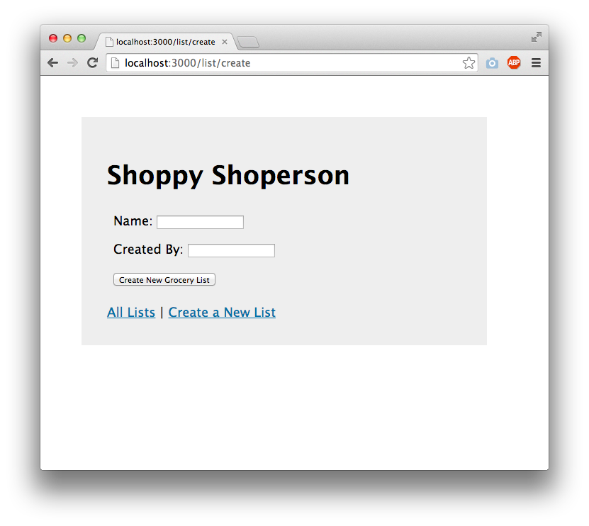
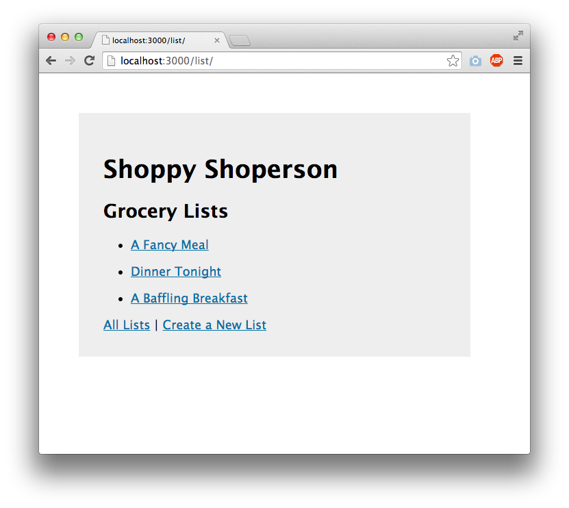
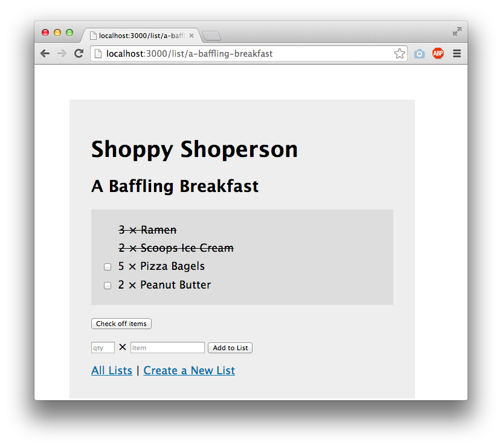

<!-- README.md -->
<!-- Copyright (c) 2024 Ishan Pranav -->
<!-- Licensed under the MIT license. -->

# Spotted

## Overview

Take **Spotted** everywhere you go - whether you're traveling or just hanging
around on campus. You'll be able to leave short notes so that anyone who visits
the same spot can read them.

Were you the first person to climb Mount Everest? How will anyone believe you if
you don't leave a note there for the next person!? Or maybe you went to an
absolutely _terrible_ food truck... leave a note behind to save anyone else who
stumbles across it!

Graffiti-up the world with your anonymous notes or sign in to react to other
notes. The ones with the best reactions stick around for others to see, while
the rest gradually vanish.

## Data model

The application only stores _registered users_ and _messages_. Each registered
user may be associated with many messages.

### Sample user

Users who want to interact with messages will sign in using a third-party
provider like Google or Microsoft. The users collection just associates a user
identifier with the third-party account information.

```javascript
{
  id: // user id
  account: // third-party sign-in account id
  imageUrl: // third-party sign-in user profile picture
}
```

### Sample message

Text messages ("notes") and their locations of origin ("spots") are stored in
the database.

In this example, the position is only accurate to 55 meters, which will be taken
into account when determining the radius in which others can see this message.

```javascript
{
  user: // a reference to a User object or a null (anonymous) user
  content: "Mark was here!",
  coordinates: {
    latitude: 40.738584,
    longitude: -74.003851,
    accuracy: 55
  },
  posted: // timestamp
}
```

### Schemata

See [user.mjs](src/user.mjs) for the first-draft user schema and
[message.mjs](src/message.mjs) for the first-draft message schema.

## Wireframes

(__TODO__: wireframes for all of the pages on your site; they can be as simple as photos of drawings or you can use a tool like Balsamiq, Omnigraffle, etc.)

/list/create - page for creating a new shopping list



/list - page for showing all shopping lists



/list/slug - page for showing specific shopping list



## Site map

(__TODO__: draw out a site map that shows how pages are related to each other)

Here's a [complex example from wikipedia](https://upload.wikimedia.org/wikipedia/commons/2/20/Sitemap_google.jpg), but you can create one without the screenshots, drop shadows, etc. ... just names of pages and where they flow to.

## Details

### Roles

- **User:** a generic role for any agent able to access the site.
- **Registered user**: a user with a registered account.
- **Non-registered user**: a user that has not signed into a registered account.

### User stories

1. As a non-registered user, I can register for a new account with the site
   using my Google account.
2. As a registered user, I can log into the site.
3. As a user, I can write a note anonymously.
4. As a registered user, I can write a note and claim authorship.
5. As a user, I can read notes that were written near my current location.
6. As a registered user, I can react to notes.

## Research topics

* (5 points) Integrate user authentication
    * I'm going to be using passport for user authentication
    * And account has been made for testing; I'll email you the password
    * see <code>cs.nyu.edu/~jversoza/ait-final/register</code> for register page
    * see <code>cs.nyu.edu/~jversoza/ait-final/login</code> for login page
* (4 points) Perform client side form validation using a JavaScript library
    * see <code>cs.nyu.edu/~jversoza/ait-final/my-form</code>
    * if you put in a number that's greater than 5, an error message will appear in the dom
* (5 points) vue.js
    * used vue.js as the frontend framework; it's a challenging library to learn, so I've assigned it 5 points

10 points total out of 8 required points (___TODO__: addtional points will __not__ count for extra credit)

## Initial prototype

Please see [app.mjs](src/app.mjs), [location.js](src/public/scripts), and the
[views](src/views/) folder.

## References

1. 